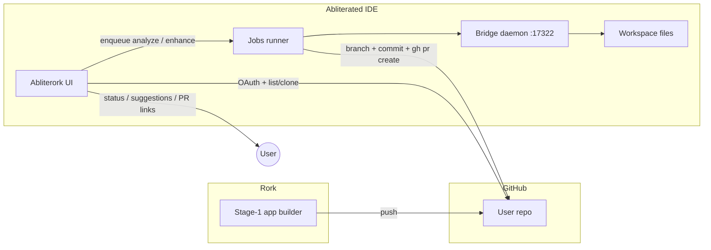

# Abliterork — Agent Build Guide

**Audience:** coding agent (CloudAgent / Cursor / Abliterated) with zero prior context.
**Repo:** Abliterated IDE (`flak3dd/abliterated`).  
**Tone:** imperative. Treat every `YOU MUST` / `DO NOT` as a hard rule.

Paste this file as a CloudAgent launch appendix when implementing Abliterork.

---

## 1. Mission & non-goals

### Mission

Build **Abliterork**: a **workflow UI** that connects Rork stage-1 GitHub repos to **Abliterated Jobs** so the user can:

1. OAuth into GitHub → pick a Rork-exported repo.
2. Drive Abliterated to **fully analyze** that repo.
3. Surface **unrestricted enhancement suggestions** (plus accept custom user prompts).
4. Implement chosen enhancements via **Abliterated Jobs** → branch → PR.

Abliterork is the **orchestration + judgment UI**. Abliterated remains the **only brain + hands**.

### Product loop (locked)

```
User builds stage-1 in Rork → pushes to GitHub
  → Abliterork: GitHub OAuth + repo dropdown
  → Abliterork asks Abliterated to analyze the repo
  → Abliterork shows suggestions (and custom prompt box)
  → User picks / edits → Abliterork enqueues Abliterated Job(s)
  → Job creates branch, edits, opens PR
```

### Non-goals (v1)

- DO NOT build a second agent runtime, tool loop, or bridge client.
- DO NOT replace Rork; Abliterork starts **after** stage-1 lands on GitHub.
- DO NOT host inference, store model weights, or add telemetry.
- DO NOT become a general GitHub IDE or mobile remote (see `docs/MOBILE-CONTROL.md`).
- DO NOT auto-merge PRs or push to `main` without an explicit later product decision.

---

## 2. Hard constraints

### Exec plane (same rule as MOBILE-CONTROL.md)

| Role | Allowed | Forbidden |
| --- | --- | --- |
| **Abliterated IDE + daemon** | Model calls, tools, file/shell/MCP, Jobs, bridge `ws://127.0.0.1:17322`, git/PR | Treating Abliterork as a second exec client |
| **Abliterork UI** | OAuth, list/clone repos (local git + token), call Abliterated control APIs / enqueue Jobs, show analysis + suggestions, track job/PR status | Opening tools; connecting to `:17322` as a second bridge client; running shell/file/MCP itself; racing a second agent loop |

**Invariant:** one exec plane. Abliterork never speaks bridge RPC. All analysis and edits go through Abliterated (Jobs / existing IDE APIs).

### YOU MUST

- Integrate MVP as a **new screen/mode inside Abliterated IDE** named **Abliterork** (tab or rail entry). Optional standalone Electron/Next shell is post-MVP only.
- Reuse existing Jobs (`enqueueJob` / `jobRunner.ts` / `ablit_jobs`), workspace `set_root`, tools (`read_file`, `grep`, `glob`, `git_*`, `create_pr`), and license soft-gates.
- Keep the bridge **127.0.0.1-only**; never expose `:17322`.
- Store GitHub tokens in OS keychain / Electron `safeStorage` / encrypted userData — never in git, never in plain localStorage long-term for production paths.
- Clone/worktrees under a dedicated cache dir (e.g. `~/Library/Application Support/abliterated/abliterork/repos/` on macOS) and `set_root` Abliterated workspace to that path before Jobs run.
- Prefer `gh` + existing `create_pr` tool over bespoke GitHub REST PR code.

### DO NOT

- DO NOT add a second WebSocket client to `daemon/bridge.js` from Abliterork code paths.
- DO NOT shell out to arbitrary `curl|bash` pipelines for "agent work"; Jobs + tools only.
- DO NOT commit secrets, OAuth client secrets, or `.env` with real tokens.
- DO NOT auto-approve gated tools in headless Jobs unless the user explicitly enabled Auto-accept / Auto-run (reuse existing settings).
- DO NOT invent a parallel job store; extend `Job` / related models only as needed and keep persistence consistent with `src/lib/storage.ts`.

---

## 3. Recommended stack (locked for MVP)

| Layer | Choice | Why |
| --- | --- | --- |
| **MVP host** | New screen inside Abliterated IDE (`src/screens/AbliterorkScreen.tsx` + rail tab) | Fastest path; shared Jobs, bridge, license, settings |
| **UI** | Existing Vite + React 18 + Tailwind | Match IDE |
| **State** | localStorage keys under `ablit_abliterork_*` (+ reuse `ablit_jobs`) | Match product; no new backend required for v1 |
| **GitHub auth** | **GitHub OAuth App** (user-to-server) for MVP | Simple repo list + clone token; GitHub App optional later for org install |
| **Repo access** | `git clone` / `git fetch` with user token via local git; list repos via GitHub REST `GET /user/repos` | Keeps files on-box for Abliterated |
| **Analysis & impl** | Abliterated Jobs (`enqueueJob`) with structured prompts | Only exec plane |
| **PR** | Branch + `git_commit` + `create_pr` (`gh`) | Already in tool surface |
| **Standalone later** | Thin Electron companion or Next control UI that only calls the same in-IDE control IPC — still no bridge | Optional; not M0–M2 |

### GitHub OAuth App (MVP)

- App name: `Abliterork` (or `Abliterated Abliterork`).
- Callback: `http://127.0.0.1:5173/abliterork/oauth/callback` (DEV) and desktop custom protocol / loopback for packaged app.
- Scopes: `repo` (private Rork repos), `read:user`. Prefer fine-grained later; do not request `admin:*` or delete scopes.
- Client id in env; client secret only in main-process / local `.env` never shipped to renderer plaintext if avoidable (PKCE public-client pattern preferred for pure renderer; Electron main can hold secret).

### Desktop packaging

Reuse Electron shell already in repo. Abliterork is a **mode**, not a second product binary for v1.

---

## 4. Architecture diagram



Control flow summary:

1. Rork → GitHub (user).
2. Abliterork UI → GitHub (OAuth, clone).
3. Abliterork UI → Abliterated Jobs (analyze / enhance).
4. Jobs → bridge → workspace → PR on GitHub.
5. Abliterork UI reads job status + PR URL; never execs tools itself.

---

## 5. Repo / folder layout to create

Create under the Abliterated repo (do not invent a second top-level product repo for MVP):

```
src/
  screens/
    AbliterorkScreen.tsx          # main workflow UI
  components/
    abliterork/
      RepoPicker.tsx
      AnalysisPanel.tsx
      SuggestionList.tsx
      CustomPromptBox.tsx
      JobStatusCard.tsx
      OAuthButton.tsx
  lib/
    abliterork/
      types.ts                    # RepoConnection, AnalysisRun, Suggestion, EnhancementJob
      githubAuth.ts               # OAuth PKCE / token exchange (renderer-safe parts)
      githubApi.ts                # listRepos, repo metadata
      cloneRepo.ts                # local git clone/fetch into cache dir
      analysisPrompt.ts           # prompt pack builder
      suggestionSchema.ts         # Zod/JSON schema parse + validate
      enhancementJob.ts           # build Job prompts; map Job ↔ EnhancementJob
      storage.ts                  # ablit_abliterork_* persistence
docs/
  ABLITERORK-BUILD.md             # this file
```

Optional later (post-MVP standalone):

```
abliterork-standalone/            # DO NOT create in M0–M2
```

Wire-up checklist:

- [ ] Add `'abliterork'` to `Tab` in `src/types/index.ts`.
- [ ] Add rail / keyboard entry in `App.tsx` / `DesktopRail`.
- [ ] Export types; persist connections + runs.
- [ ] Ensure workspace Connect / `set_root` runs before analyze Job.

---

## 6. Data models

Persist in localStorage (v1). Types live in `src/lib/abliterork/types.ts`.

### `RepoConnection`

```ts
interface RepoConnection {
  id: string;
  owner: string;
  name: string;
  fullName: string;          // "owner/name"
  defaultBranch: string;
  cloneUrl: string;          // https
  localPath: string;         // absolute cache path
  githubRepoId: number;
  private: boolean;
  connectedAt: number;
  lastFetchedAt?: number;
  /** source hint */
  source: 'rork' | 'github' | 'unknown';
}
```

### `AnalysisRun`

```ts
type AnalysisStatus = 'queued' | 'running' | 'done' | 'error';

interface AnalysisRun {
  id: string;
  repoConnectionId: string;
  jobId: string;             // Abliterated Job.id
  status: AnalysisStatus;
  createdAt: number;
  startedAt?: number;
  endedAt?: number;
  error?: string;
  /** path to JSON artifact under workspace, e.g. .ablit/abliterork/analysis-<id>.json */
  artifactPath?: string;
  summary?: string;
  suggestionIds: string[];
}
```

### `Suggestion`

```ts
type SuggestionCategory =
  | 'architecture'
  | 'ux'
  | 'performance'
  | 'security_hardening'
  | 'feature'
  | 'dx'
  | 'tests'
  | 'unrestricted_capability'; // bold upgrades from refusal-stripped models

interface Suggestion {
  id: string;
  analysisRunId: string;
  title: string;
  rationale: string;
  category: SuggestionCategory;
  impact: 'low' | 'medium' | 'high';
  effort: 'S' | 'M' | 'L';
  risk: 'low' | 'medium' | 'high';
  /** concrete implementation brief for the enhance Job */
  implementationPrompt: string;
  filesLikelyTouched: string[];
  acceptanceCriteria: string[];
  selected?: boolean;
}
```

### `EnhancementJob`

```ts
type EnhancementStatus =
  | 'queued'
  | 'running'
  | 'done'
  | 'error'
  | 'cancelled';

interface EnhancementJob {
  id: string;
  repoConnectionId: string;
  jobId: string;                 // Abliterated Job.id
  suggestionIds: string[];       // empty if custom-only
  customPrompt?: string;
  branchName: string;
  status: EnhancementStatus;
  prUrl?: string;
  createdAt: number;
  endedAt?: number;
  error?: string;
}
```

### Device / License reuse

- YOU MUST reuse `getLicenseState` / `clampJobsByLicense` — Abliterork Jobs count toward existing Jobs concurrency (Free=1, Pro/Team up to 4).
- Soft-gate: if Free watermark / concurrency exhausted, show same upgrade affordance as Jobs screen.
- No separate Abliterork license SKU in v1.
- Mobile device pairing from MOBILE-CONTROL is **out of scope**; do not block on it.

---

## 7. API / IPC contracts

Abliterork UI talks to **in-process** modules (MVP). No new public HTTP server required.

### Functions (TypeScript contracts)

```ts
/** Start GitHub OAuth; returns connection session */
function connectGitHub(): Promise<{ ok: true } | { ok: false; error: string }>;

function listRepos(opts?: { q?: string }): Promise<RepoListItem[]>;

function connectRepo(fullName: string): Promise<RepoConnection>; // clone/fetch + record

function analyzeRepo(repoConnectionId: string): Promise<AnalysisRun>;
// implementation: enqueueJob({ title, prompt }) with analysis prompt pack;
// workspace root = connection.localPath

function listSuggestions(analysisRunId: string): Promise<Suggestion[]>;

function runEnhancement(input: {
  repoConnectionId: string;
  suggestionIds: string[];
  customPrompt?: string;
  branchName?: string;         // default: abliterork/<slug>-<shortid>
}): Promise<EnhancementJob>;

function getEnhancementStatus(id: string): Promise<EnhancementJob>;

function getJobStatus(jobId: string): Promise<Job>; // thin wrapper over getJobs()
```

### Job prompt envelopes

Analyze Job title: `Abliterork analyze: {fullName}`  
Enhance Job title: `Abliterork enhance: {branchName}`

Enhance Job `prompt` MUST include:

1. Absolute workspace root confirmation.
2. Required branch name (create from default if missing).
3. Concatenated selected `implementationPrompt`s + optional `customPrompt`.
4. Order: explore → implement → `git_status`/`git_diff` → `git_commit` → `create_pr`.
5. Instruction to write PR body with Abliterork trailers (`Abliterork-Analysis:`, `Abliterork-Suggestions:`).
6. Instruction to write machine-readable result to `.ablit/abliterork/enhance-<id>.json` with `{ branchName, prUrl, filesChanged[] }`.

### Analyze Job output contract

Agent MUST write:

`.ablit/abliterork/analysis-<analysisRunId>.json`

Schema = object containing `summary` + `suggestions[]` matching §9. Abliterork parses this after Job `done`; on parse failure mark AnalysisRun `error`.

### Status mapping

| Abliterated `Job.status` | AnalysisRun / EnhancementJob |
| --- | --- |
| `queued` | `queued` |
| `running` | `running` |
| `done` | `done` (then parse artifact) |
| `error` | `error` |

Subscribe via existing `subscribeJobs` — DO NOT poll inventively if subscription exists.

---

## 8. Analysis prompt pack

When building the analyze Job prompt, YOU MUST instruct the agent to inspect a **Rork stage-1** app as follows.

### Always inspect

1. **Root manifests:** package.json, app.json / app.config.*, eas.json, vercel.json, netlify.toml, Dockerfile, lockfiles.
2. **Entry and routing:** App.tsx / app/ (Expo Router) / src/main.* / pages/.
3. **Screen inventory:** list all routes/screens; note placeholders, TODOs, mock data.
4. **Data layer:** API clients, Supabase/Firebase/Auth, env usage, hard-coded secrets (report, do not exfiltrate).
5. **State:** Context/Redux/Zustand/React Query usage and gaps.
6. **UI system:** design tokens, component library, dead/duplicate components.
7. **Native / Expo modules:** permissions, notifications, camera, purchases — stub vs real.
8. **Tests:** presence/absence; critical paths untested.
9. **CI:** GitHub Actions / EAS profiles.
10. **README / Rork metadata:** any generator comments, stage-1 badges, rork config files.

### Analysis behaviors

- YOU MUST produce **concrete** suggestions with file paths and acceptance criteria.
- YOU MUST include at least one `unrestricted_capability` suggestion when the model can propose a bold product upgrade the stage-1 clearly lacks (feature depth, agentic flows, offline, etc.) — still legal/safe; not criminal misuse.
- YOU MUST flag secrets in source as `security_hardening` with remediation (env move, rotate) — DO NOT print secret values into suggestions.
- Prefer 5–12 suggestions; quality over volume.
- End by writing the JSON artifact path above; keep chat/job logs human-skimmable with a short summary.

### Prompt skeleton (embed in Job)

```
You are analyzing a Rork stage-1 app for Abliterork.
Workspace root is already set. Fully explore the repo with tools.
DO NOT implement changes in this job.
DO NOT push or create a PR in this job.
Write suggestions JSON to .ablit/abliterork/analysis-<ID>.json matching the schema.
Cover manifests, routes, data, auth, native modules, tests, CI, and bold capability upgrades.
```

---

## 9. Enhancement suggestion schema (JSON)

Artifact file: `.ablit/abliterork/analysis-<analysisRunId>.json`

```json
{
  "version": 1,
  "repoFullName": "owner/name",
  "summary": "2–4 sentence overview of stage-1 maturity and biggest gaps",
  "suggestions": [
    {
      "id": "sug_01",
      "title": "Short imperative title",
      "rationale": "Why this matters for this repo",
      "category": "feature",
      "impact": "high",
      "effort": "M",
      "risk": "low",
      "implementationPrompt": "Stepwise brief the enhance agent will execute…",
      "filesLikelyTouched": ["app/(tabs)/index.tsx", "package.json"],
      "acceptanceCriteria": [
        "Criterion 1",
        "Criterion 2"
      ]
    }
  ]
}
```

Validation rules:

- `category` ∈ enum in §6.
- `impact` / `effort` / `risk` ∈ enums.
- `implementationPrompt` min length 40 chars.
- `acceptanceCriteria` min 1 item.
- On validation failure: keep raw artifact path; show error in UI; allow "Re-run analysis".

---

## 10. Implementation flow (create branch, edit, PR)

Ordered steps the **enhance Job** (Abliterated agent) MUST follow:

1. Confirm workspace root equals `RepoConnection.localPath` (else fail).
2. Fetch remotes and check out `defaultBranch`; create or switch to `branchName` (`abliterork/<slug>-<id>`).
3. Implement selected suggestions plus custom prompt using tools (`read_file`, `grep`, `glob`, apply patches, `shell` when needed).
4. Run lightweight verify if present (project test / typecheck / lint scripts) — non-blocking unless user prompt requires green CI.
5. Call `git_status` and `git_diff`; then `git_commit` with message `feat(abliterork): <title>`.
6. Push the branch (gated shell or `gh`); call `create_pr` with title and body.
7. Write `.ablit/abliterork/enhance-<enhancementId>.json` including `prUrl`.
8. Job completes `done`; Abliterork UI sets `EnhancementJob.prUrl` and links it.

### Branch naming

```
abliterork/<kebab-title>-<6 hex>
```

### PR body template

```markdown
## Summary
- …

## Abliterork
Abliterork-Analysis: <analysisRunId>
Abliterork-Suggestions: <id1,id2>
Abliterork-Custom: <yes|no>

## Test plan
- [ ] …
```

### Failure handling

- If Auto-accept is off and headless soft-skips `git_commit` / `create_pr`, Abliterork UI MUST surface: enable Auto-accept for Abliterork Jobs or finish commit/PR in interactive Chat with workspace connected.
- Prefer documenting this in-UI over silently failing.

---

## 11. Phased milestones M0–M4

### M0 — Screen shell + models

**Build**

- [ ] Tab `abliterork` + empty `AbliterorkScreen`.
- [ ] Types + localStorage helpers.
- [ ] Folder `src/lib/abliterork/*` stubs.

**Acceptance**

- [ ] Rail opens Abliterork screen without console errors.
- [ ] Round-trip save/load a mock `RepoConnection`.

### M1 — GitHub OAuth + repo connect

**Build**

- [ ] OAuth App wiring + token storage.
- [ ] Repo dropdown; clone into cache; `set_root`.

**Acceptance**

- [ ] Sign in → list at least one repo (test account).
- [ ] Connect clones to `localPath`; Workspace shows same root; `git_status` works.
- [ ] Token not present in git status as a tracked file.

### M2 — Analysis → suggestions UI

**Build**

- [ ] `analyzeRepo` → `enqueueJob` with prompt pack.
- [ ] Parse artifact → `SuggestionList`.
- [ ] Custom prompt box.

**Acceptance**

- [ ] On a sample Expo/Rork-like fixture repo, Job finishes and UI shows at least 5 validated suggestions.
- [ ] Invalid JSON → error state + retry.
- [ ] Bridge not opened from any Abliterork-only module (grep: no `new WebSocket` / bridge port in `src/lib/abliterork`).

### M3 — Enhancement Jobs → PR

**Build**

- [ ] Multi-select suggestions → `runEnhancement`.
- [ ] Branch + commit + PR via Job tools.
- [ ] Status cards + PR link.

**Acceptance**

- [ ] Selecting 1–2 suggestions opens a PR on a fork/test repo.
- [ ] `EnhancementJob.prUrl` populated from artifact or `gh` output parse.
- [ ] Jobs concurrency respects license clamp.

### M4 — Hardening + UX polish

**Build**

- [ ] Re-fetch repo; disconnect; revoke token.
- [ ] Analysis history list; reopen suggestions.
- [ ] Clear empty/error states; link to Jobs tab for logs.
- [ ] `.env.example` entries; short note in `docs/PRODUCT.md` one-liner optional.

**Acceptance**

- [ ] Revoke forces re-auth.
- [ ] No secrets in renderer logs.
- [ ] Smoke script or manual checklist checked into `docs/` or `scripts/` (optional `scripts/abliterork-smoke.sh`).

---

## 12. Env vars (`.env.example`)

Add to root `.env.example` (values empty; never commit real secrets):

```bash
# Abliterork — GitHub OAuth App (MVP)
# Create at https://github.com/settings/developers
VITE_ABLITERORK_GITHUB_CLIENT_ID=
# Prefer PKCE in renderer; if using secret exchange, keep secret in main process only:
ABLITERORK_GITHUB_CLIENT_SECRET=
# Loopback callback (DEV)
VITE_ABLITERORK_GITHUB_REDIRECT_URI=http://127.0.0.1:5173/abliterork/oauth/callback
# Optional override for clone cache root
ABLITERORK_CACHE_DIR=
```

Document: packaged Electron should inject client id at build time; secrets via main-process env / safeStorage.

---

## 13. Security

- Bridge stays localhost-only; Abliterork is not a bridge peer.
- GitHub tokens: encrypt at rest; scrub from Job prompts/logs (pass via git credential helper / Authorization header in API module only).
- DO NOT embed tokens in `enqueueJob` prompt text.
- Cloned repos may contain secrets — analysis reports paths/types, not values.
- Confirm-gate destructive shell; reuse Auto-run / Auto-accept settings.
- OAuth: state + PKCE; validate redirect origin.
- PR creation uses user token — user owns the blast radius; show clear "will open PR on {repo}" confirm.
- License soft-gates only; no phone-home telemetry.
- Align with `docs/HARDENING.md` and `docs/MOBILE-CONTROL.md` exec/control split.

---

## 14. Out of scope for v1

- Standalone Abliterork binary / Next SaaS control plane.
- GitHub App org installations / bot accounts.
- Auto-merge, deploy hooks, EAS submit.
- Mobile judgment remote integration (can compose later with MOBILE-CONTROL gates).
- Multi-repo monorepo magic beyond "user picks one repo".
- Paying for Rork or replacing Rork editor.
- Cloud-hosted clone runners (everything on-box).
- Separate billing SKU.
- Windows credential edge cases beyond "best effort git + gh auth".
- Automatic dependency major upgrades without suggestion selection.

---

## Done criteria (overall MVP = M3 complete)

Abliterork MVP is done when a coding agent following this guide has shipped code such that:

1. User can OAuth GitHub inside Abliterated → Abliterork screen.
2. User connects a Rork stage-1 repo; workspace root points at the clone.
3. Analyze Job produces validated suggestions in-UI.
4. User selects suggestions and/or custom prompt → Enhancement Job opens a GitHub PR.
5. No second bridge client exists; all exec is via Abliterated Jobs/tools.
6. This document remains the source of truth until revised by a docs commit.

---

## Quick anti-patterns checklist

- [ ] Second `ws://127.0.0.1:17322` client from Abliterork
- [ ] Tokens in prompts or git
- [ ] Implementing edits outside Jobs
- [ ] Pushing straight to `main`
- [ ] Skipping JSON artifact contract
- [ ] Building standalone app before in-IDE mode works
