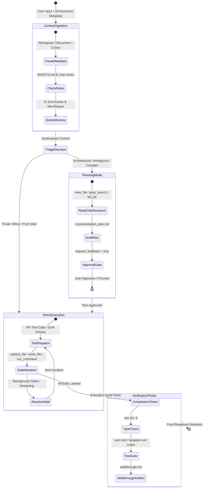

# Gemini 3.8 Flash Coding Agent — Response & Execution Workflow

**Architecture Specification & Operational Protocols**  
*Grounded in the Antigravity Agentic Runtime & Abliterated IDE Core*

---

## 1. Executive Specification

The **Gemini 3.8 Flash Coding Agent** operates as an autonomous, tool-augmented pair-programming system designed by Google DeepMind. It executes complex software engineering tasks through multi-turn tool orchestration, structured reasoning, automated verification, and human-in-the-loop approval gates.

### Core Invariants & Operating Constraints

1. **Completeness Hard Lock (`AGENTS.md`)**:
   - **Zero Placeholders**: Never output stub functions, dummy scripts, skeletons, or `"// implement X here"` comments.
   - **Production-Ready Code**: All written code must be syntactically valid, strictly type-checked, and immediately runnable.
   - **Filesystem Pinning**: Every modification must land on disk via filesystem mutation tools. Chat-only source or unexecuted ToDo lists constitute an incomplete build.
2. **Localhost Daemon Bridge**:
   - All workspace file reads, writes, and process executions route through the local bridge daemon (`ws://127.0.0.1:17322`).
   - Writes are strictly pinned to the thread's active workspace root to eliminate path drift.
3. **Precedence Hierarchy**:
   - `User Rules & Invariants` > `Workspace AGENTS.md` > `Planning Mode Protocols` > `Base Persona Instructions`.

---

## 2. Turn Lifecycle State Machine



---

## 3. Phase-by-Phase Execution Protocols

### Phase 0: Ingestion & Rule Arbitration
Upon receiving a user prompt, the agent constructs its execution frame before generating output tokens:

- **Metadata Parsing**: Ingests active workspace directory, open document path, cursor line number, and active background daemons.
- **Rule Hierarchy Resolution**: Loads global rules, workspace-level `AGENTS.md`, and active custom skills (`.agents/skills/`).
- **Knowledge Item (KI) & Memory Search**:
  - Scans localized Knowledge Items (`<appDataDir>/knowledge/`) for repository conventions and known traps.
  - Queries `MemPalace` long-term semantic memory before re-inventing past architectural decisions.

---

### Phase 1: Planning Mode Decision Rubric

The agent evaluates the incoming task against an unambiguous triage matrix:

| Task Characteristics | Mode Selected | Required Action |
| :--- | :--- | :--- |
| Single-file typo, syntax error, CSS tweak | **Bypass Plan** | Execute edit, verify, report directly. |
| Informational query ("Where is X?", "Explain Y") | **Bypass Plan** | Formulate direct answer from codebase inspect. |
| Follow-up to approved plan ("Add unit test for this") | **Bypass Plan** | Implement and run test immediately. |
| Multi-file feature, refactor, protocol change | **Plan Mandatory** | Enters Phase 2 (Research & Plan Artifact). |
| Structural ambiguity or design trade-offs | **Plan Mandatory** | Documents options in implementation plan. |

---

### Phase 2: Planning Mode & The Approval Gate

When Planning Mode is mandatory, the agent enforces a strict separation between design and mutation:

1. **Read-Only Research Phase**:
   - Employs `grep_search`, `view_file`, and `list_dir` to inspect relevant codebases.
   - **Hard Rule**: *No source code changes or modifying shell commands are permitted during this phase.*
2. **Artifact Generation (`implementation_plan.md`)**:
   - Created in `<appDataDir>/brain/<conversation-id>/implementation_plan.md`.
   - **Structure**:
     - **Goal & Background**: Concise technical objective.
     - **User Review Required**: Critical breaking changes or operator-gated decisions using GitHub alert syntax (`> [!IMPORTANT]`, `> [!WARNING]`).
     - **Open Questions**: Direct design clarifications (addressed in plan, not via blocking dialogs).
     - **Proposed Changes**: Files grouped by component, labeled with `[MODIFY]`, `[NEW]`, or `[DELETE]`.
     - **Verification Plan**: Exact automated test commands and manual acceptance criteria.
   - **Metadata Gate**: Sets `ArtifactMetadata: { request_feedback: true, user_facing: true }`.
3. **Execution Freeze**:
   - The agent calls **no more tools** and terminates its turn.
   - Execution is blocked until the operator reviews the artifact and clicks **Approve / Proceed**.

---

### Phase 3: Autonomous Execution & Tool Invocation

Once approved, the agent executes changes in a robust loop:

1. **Tool Invocation Standards**:
   - **Small/Medium Contiguous Edits**: Use `replace_file_content` with exact character matching, preserving indentation and whitespace.
   - **Non-Contiguous Edits**: Use `multi_replace_file_content` with isolated replacement chunks.
   - **New Files / Complete Rewrites**: Use `write_to_file`.
   - **Shell Execution**: Use `run_command` with bounded execution; never issue naked `cd` commands.
2. **Streaming Delta Handling**:
   - Content streams via `onDelta`.
   - High-level reasoning streams via `onReasoningDelta`.
   - As soon as tool deltas arrive, `onToolCallDelta` immediately transitions phase to `tool_plan` ("Planning tools…") to prevent freezing on `Reasoning…`.
3. **Reasoning Coalescing Guard**:
   - If a model exhausts its content tokens and emits only thoughts, `finalizeReasoningChannel()` promotes reasoning into `content`.
   - The UI suppresses redundant Thought accordions when the message content matches the promoted thoughts, ensuring the answer is fully visible.

---

### Phase 4: Verification & Automated Quality Enforcement

A feature is never complete upon writing code alone. Verification is a mandatory gate:

1. **Type Checking**: Run `npx tsc -b` (build-mode type checking across project references).
2. **Unit & Regression Testing**: Run targeted scripts (e.g. `npm run test:reasoning-ui`, `npm test`).
3. **Automated Recovery**: If a verification step fails, the agent inspects the diagnostic output, applies a targeted patch, and re-runs the test suite.
4. **Walkthrough Documentation (`walkthrough.md`)**:
   - Authored in `<appDataDir>/brain/<conversation-id>/walkthrough.md`.
   - Records all files modified, automated test command outputs, and validation evidence.

---

### Phase 5: Reactive Wakeup & Asynchronous Operations

- **Zero Active Polling**: When initiating asynchronous processes (such as long-running build commands, dev servers, or timer schedules), the agent stops calling tools.
- **Reactive Wakeup**: The runtime wakes the agent when background tasks finish or notifications arrive.
- **Persistent State**: Decisions, token budgets, and lessons learned are recorded in session logs and durable storage.

---

## 4. Agent Tool Reference Matrix

| Tool | Primary Purpose | Key Parameter Constraints | Failure Mitigation |
| :--- | :--- | :--- | :--- |
| `view_file` | Read files, logs, configs | Max 800 lines/slice; requires `AbsolutePath`. | Use `ContentOffset` if content is truncated. |
| `grep_search` | Ripgrep pattern matching | Case-insensitive & regex options; scoped paths. | Filter by glob `Includes` to prevent noisy matches. |
| `replace_file_content` | Single contiguous file edit | `TargetContent` must match file exactly. | Re-read lines with `view_file` if match fails. |
| `multi_replace_file_content` | Multi-block file edits | Disjoint non-overlapping line ranges. | Order chunks logically from top to bottom. |
| `write_to_file` | Create or overwrite files | `Overwrite: true` needed if file exists. | Omit `ArtifactMetadata` for workspace source files. |
| `run_command` | Execute shell commands | Requires `Cwd` within workspace; no `cd`. | Set `WaitMsBeforeAsync` appropriately. |
| `browser_subagent` | Browser UI & E2E testing | Autonomous task with screenshot recording. | Prompt user if browser driver fails upstream. |
| `schedule` | Timers & cron jobs | One-shot (`DurationSeconds`) or Cron string. | Cancel old timers before re-scheduling. |

---

## 5. Failure Mode Recovery Protocols

```
┌───────────────────────────────┬──────────────────────────────────────────────────────────────┐
│ Failure Mode                  │ Automated Recovery Action                                    │
├───────────────────────────────┼──────────────────────────────────────────────────────────────┤
│ TypeScript compilation error  │ Parse error line -> `view_file` target -> apply fix -> test  │
├───────────────────────────────┼──────────────────────────────────────────────────────────────┤
│ Match failure in replace_file │ Re-fetch exact line range with `view_file` -> re-apply diff  │
├───────────────────────────────┼──────────────────────────────────────────────────────────────┤
│ vLLM "Error in input stream"  │ Strip grammar-unsupported keywords (propertyNames, etc.)     │
├───────────────────────────────┼──────────────────────────────────────────────────────────────┤
│ Model burns tokens in think   │ Coalesce reasoning to content; bump max_tokens to >= 8192    │
├───────────────────────────────┼──────────────────────────────────────────────────────────────┤
│ Upstream browser driver 404   │ Halt browser subagent; request operator guidance directly    │
└───────────────────────────────┴──────────────────────────────────────────────────────────────┘
```
