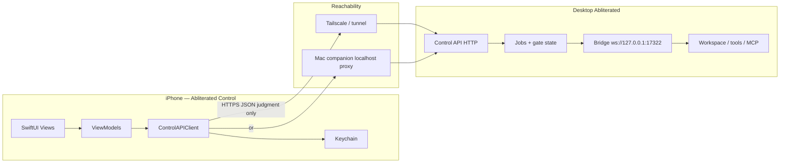

# iPhone Swift — Agent Build Guide (Mobile Control Plane)

**Audience:** coding agent (CloudAgent / Cursor / Abliterated) with zero prior context.
**Repo:** Abliterated IDE (`flak3dd/abliterated`).
**Tone:** imperative. Treat every `YOU MUST` / `DO NOT` as a hard rule.
**Cross-link:** [`docs/MOBILE-CONTROL.md`](./MOBILE-CONTROL.md) — **phone is judgment remote only.** Read that doc’s rules before writing a single line of Swift.

Paste this file as a CloudAgent launch appendix when implementing the iOS judgment client.

---

## 1. Mission & non-goals

### Mission

Build **Abliterated Control**: a **SwiftUI iPhone app** that pairs to the **desktop control plane** so the operator can:

1. Pair the phone to a running Abliterated desktop/daemon (site `loginId` + `deviceId` binding, or desktop pair code).
2. See **Job cards** and **gate state** (`gated(reason)` and related job status).
3. Fire the four judgment verbs: **Approve**, **Reject**, **Deepen**, **Inject**.
4. Keep Jobs parked on-box until judgment arrives — never migrate execution to the phone.

The phone is a **thin judgment remote**. Abliterated on the Mac/box remains the **only brain + hands**.

### Product loop (locked)

```
Desktop Job enters gated(reason)
  → Control API surfaces gate + digest to phone
  → Operator reviews Job card / GateBanner
  → Approve | Reject | Deepen | Inject
  → Desktop resumes or stops; audit record attached
  → Phone refreshes job/gate state
```

### Non-goals (v1)

- DO NOT build a second agent runtime, tool loop, MCP client, or shell on iOS.
- DO NOT connect to the tool bridge `ws://127.0.0.1:17322` (or any bridge port).
- DO NOT become a second exec client of the bridge.
- DO NOT host inference, store model weights, or add product telemetry.
- DO NOT ship a full IDE, file browser, or workspace editor on phone.
- DO NOT auto-approve on notification dismiss, timeout, or background.
- DO NOT expose the bridge beyond localhost “so the phone can reach it.”

---

## 2. Hard constraints (cite MOBILE-CONTROL)

Source of truth: [`docs/MOBILE-CONTROL.md`](./MOBILE-CONTROL.md).

### Split: Desktop/daemon vs Phone

| | Desktop + daemon (box) | Phone (judgment remote) |
| --- | --- | --- |
| **Role** | Brain + hands | Judgment remote |
| **Allowed** | Model calls, tool use, file/shell/MCP, Jobs lifecycle, bridge WS, gate evaluation | View job/gate state; Approve / Reject / Deepen / Inject; push/poll notifications |
| **Forbidden** | Treating phone as a second agent | Opening tools; connecting to `ws://127.0.0.1:17322`; becoming a bridge exec client; running shell/file/MCP |

**Invariant:** **one exec plane, one judgment channel.** The phone does not share the bridge.

### Control plane vs exec plane

| Plane | Where | What travels |
| --- | --- | --- |
| **Exec** | Desktop/daemon on the box | Completions, tool calls, workspace I/O, MCP, Jobs runners — via the **local bridge** |
| **Control** | Phone ↔ **control API** (not the bridge) | Gate reasons, job summaries, verb payloads, status fan-out |

### YOU MUST

- Talk only to the **Control API** (HTTP/HTTPS JSON) exposed by desktop/daemon/companion — never to `:17322`.
- Treat gated Jobs as **parked on-box**; phone only sends judgment verbs.
- Persist pairing secrets in **Keychain** (`loginId`, `deviceId`, pair token / session token).
- Implement all four verbs as **judgment**, not remote tool execution.
- Cite / obey MOBILE-CONTROL anti-patterns for every networking decision.
- Keep App Transport Security on; prefer Tailscale / private tunnel / Mac companion loopback bridge for reachability.

### DO NOT

- DO NOT open `URLSessionWebSocketTask` (or any WS client) to `127.0.0.1:17322` or any bridge RPC surface.
- DO NOT add MCP, shell, file tools, or “run this command” UI on iOS.
- DO NOT auto-approve on push timeout, swipe-away, or app kill.
- DO NOT treat Deepen/Inject as remote tool calls — they are control verbs with text payloads interpreted **on-box**.
- DO NOT ship a second agent loop that races the desktop brain.
- DO NOT request bridge exposure beyond localhost as a “feature.”
- DO NOT collapse human gates into model refusal / safety theater.

---

## 3. Stack lock

| Layer | Choice | Why |
| --- | --- | --- |
| **UI** | **SwiftUI** | Native, checklist-friendly, iOS 17+ APIs |
| **Minimum OS** | **iOS 17.0+** | `@Observable`, modern navigation, reliable async |
| **Concurrency** | **async/await** + `URLSession` | No Combine-for-networking spaghetti; structured concurrency |
| **Architecture** | Views → `@Observable` ViewModels → `ControlAPIClient` | Thin client; testable without UI |
| **Deps** | **No unnecessary SPM packages** | Stdlib + Foundation + SwiftUI only for MVP. DO NOT add Alamofire, Firebase, analytics SDKs, or “agent” frameworks |
| **Auth storage** | **Keychain** (Security framework) | Tokens / loginId / deviceId |
| **Local prefs** | `UserDefaults` only for non-secrets (base URL, last pair display name) | Never tokens |
| **Push (Phase 2)** | APNs via desktop-relayed device token — optional | Gate-waiting only |
| **Xcode** | Xcode 15+ / 16+, single iOS app target | Simulator + device |

### Xcode project layout (locked for MVP)

```
ios/AbliteratedControl/          # inside abliterated monorepo — LOCKED for MVP
  AbliteratedControl.xcodeproj
  AbliteratedControl/
    App/
    Models/
    Services/
    ViewModels/
    Views/
    Resources/
  AbliteratedControlTests/
```

- YOU MUST create the app under **`ios/AbliteratedControl/`** in this monorepo for MVP.
- DO NOT invent a separate GitHub repo for MVP unless product later splits packaging.
- Separate-repo extract is post-MVP only.

---

## 4. Architecture



**Control flow summary:**

1. iPhone → Control API (via Tailscale, user tunnel, or Mac companion that forwards to desktop control port).
2. Control API → Jobs / gate store on desktop.
3. Jobs → bridge → workspace (desktop-only).
4. Bridge **stays desktop-only**. Phone never appears as a bridge peer.

**Reachability notes (MVP):**

- Preferred private mesh: Tailscale MagicDNS / IP → desktop control port (e.g. `https://mac.tailnet:17380` — exact port is a desktop contract; see §6 / §12).
- Alternate: Mac companion app/process binds loopback on Mac and exposes control API to Tailscale / LAN with auth.
- Simulator DEV: `http://127.0.0.1:<controlPort>` when desktop runs on same Mac as Simulator.
- DO NOT punch `:17322` through any tunnel.

---

## 5. Pairing & auth flows

Reuse site **`loginId` + `deviceId` binding** where possible; otherwise **desktop pair code**.

### A. Site loginId + deviceId (preferred when account exists)

1. User signs in on phone with the same Abliterated account used on desktop (or pastes `loginId` from Settings if product exposes it).
2. App generates or loads a stable **`deviceId`** (UUID in Keychain; create once).
3. `POST /v1/control/pair/device` with `{ loginId, deviceId, deviceName, platform: "ios" }`.
4. Desktop/control server returns `{ pairToken, expiresAt }` (or session JWT). Store in Keychain.
5. All subsequent Control API calls send:
   - `Authorization: Bearer <pairToken>`
   - Headers: `X-Ablit-Login-Id`, `X-Ablit-Device-Id` (or embed claims in JWT — desktop picks one; client MUST support both header style and bearer-only).

### B. Desktop pair code (LAN / Tailscale bootstrap)

1. Desktop Settings → **Mobile Control** → **Show pair code** (6–8 chars, short TTL, single-use).
2. Phone **Pair** screen: enter code + optional control base URL (prefill Tailscale host if known).
3. `POST /v1/control/pair/code` with `{ code, deviceId, deviceName }`.
4. On success: receive `{ loginId?, pairToken, controlBaseUrl?, expiresAt }`; persist to Keychain.
5. Invalidate code on desktop after successful bind.

### C. Unpair / revoke

- Phone: Settings → Unpair → delete Keychain items; `POST /v1/control/pair/revoke`.
- Desktop: revoke `deviceId` → phone receives `401` and MUST clear session and show Pair screen.

### YOU MUST

- Generate `deviceId` once; never regenerate on every launch.
- Store `pairToken`, `loginId`, `deviceId` in Keychain with `kSecAttrAccessibleAfterFirstUnlockThisDeviceOnly` (or stricter).
- Fail closed on `401`/`403`: clear tokens, stop polling, show Pair UI.

### DO NOT

- DO NOT store tokens in `UserDefaults`, files, or iCloud.
- DO NOT reuse bridge hello/auth for phone pairing.
- DO NOT allow anonymous Control API in production builds.

---

## 6. Control API contract (desktop must expose)

Base path suggestion: `/v1/control` on a **dedicated control HTTP server** (Electron main, daemon companion, or small sidecar). **Not** the bridge WebSocket.

All endpoints require pairing auth unless noted.

### 6.1 `GET /v1/control/jobs`

List jobs visible to the paired operator (at least gated + recent active).

**Query:** `?state=gated|running|all` (default `all` with gated first), `?limit=50`

**Response `200`:**

```json
{
  "jobs": [
    {
      "id": "job_01HZX...",
      "title": "Implement auth hardening",
      "state": "gated",
      "summary": "Short human digest of current step",
      "createdAt": "2026-09-05T12:00:00.000Z",
      "updatedAt": "2026-09-05T12:05:00.000Z",
      "gate": {
        "reason": "About to run destructive shell on production-like path",
        "gatedAt": "2026-09-05T12:05:00.000Z",
        "contextDigest": "rm -rf ./build && ...",
        "gateType": "tool_confirm"
      }
    }
  ]
}
```

### 6.2 `GET /v1/control/jobs/:id`

Single job detail (same object shape as list item; may include longer digest / recent events).

### 6.3 `GET /v1/control/gate`

Convenience: currently gated jobs only (or singleton “primary gate” if product is single-job).

**Response `200`:**

```json
{
  "gated": [
    {
      "jobId": "job_01HZX...",
      "reason": "…",
      "gatedAt": "2026-09-05T12:05:00.000Z",
      "contextDigest": "…",
      "gateType": "tool_confirm"
    }
  ]
}
```

### 6.4 Judgment verbs

| Method | Path | Body |
| --- | --- | --- |
| `POST` | `/v1/control/jobs/:id/approve` | `{ "note"?: string }` |
| `POST` | `/v1/control/jobs/:id/reject` | `{ "reason"?: string }` |
| `POST` | `/v1/control/jobs/:id/deepen` | `{ "directive"?: string }` |
| `POST` | `/v1/control/jobs/:id/inject` | `{ "text": string }` **required** |

**Shared success `200`:**

```json
{
  "ok": true,
  "jobId": "job_01HZX...",
  "state": "running",
  "judgment": {
    "verb": "approve",
    "at": "2026-09-05T12:06:00.000Z",
    "deviceId": "…",
    "loginId": "…",
    "note": null
  }
}
```

**Errors:**

| Code | When |
| --- | --- |
| `401` | Missing/invalid pair token |
| `403` | Device revoked / login mismatch |
| `404` | Unknown job |
| `409` | Job not gated (or already resumed) — client MUST refresh |
| `422` | Inject missing `text` / validation |

### 6.5 Pairing endpoints

| Method | Path | Body |
| --- | --- | --- |
| `POST` | `/v1/control/pair/code` | `{ "code", "deviceId", "deviceName" }` |
| `POST` | `/v1/control/pair/device` | `{ "loginId", "deviceId", "deviceName", "platform": "ios" }` |
| `POST` | `/v1/control/pair/revoke` | `{ "deviceId" }` |
| `GET` | `/v1/control/pair/status` | — returns `{ paired, deviceId, loginId?, controlBaseUrl? }` |

### 6.6 JSON schemas (Swift-facing)

```swift
// Canonical wire models — keep field names snakeCase or camelCase consistently.
// YOU MUST pick camelCase JSON with `JSONDecoder.keyDecodingStrategy = .convertFromSnakeCase`
// OR encode camelCase on desktop. Lock one strategy in ControlAPIClient.

enum JobState: String, Codable {
  case queued, running, gated, done, failed, cancelled
}

struct GateInfo: Codable, Hashable {
  var reason: String
  var gatedAt: Date
  var contextDigest: String?
  var gateType: String?
}

struct ControlJob: Codable, Identifiable, Hashable {
  var id: String
  var title: String
  var state: JobState
  var summary: String?
  var createdAt: Date
  var updatedAt: Date
  var gate: GateInfo?
}

struct JudgmentRecord: Codable {
  var verb: String
  var at: Date
  var deviceId: String?
  var loginId: String?
  var note: String?
}

struct JudgmentResponse: Codable {
  var ok: Bool
  var jobId: String
  var state: JobState
  var judgment: JudgmentRecord
}

struct InjectBody: Codable {
  var text: String
}

struct DeepenBody: Codable {
  var directive: String?
}

struct ApproveBody: Codable {
  var note: String?
}

struct RejectBody: Codable {
  var reason: String?
}
```

### DO NOT (API)

- DO NOT add `/tools`, `/exec`, `/mcp`, `/shell`, or bridge-proxy routes to the control server.
- DO NOT accept tool-call JSON from the phone.
- DO NOT auto-approve when the client disconnects.

---

## 7. Swift models + ViewModel + Views

### Models (`Models/`)

- `ControlJob`, `GateInfo`, `JobState`, `JudgmentResponse`, pair DTOs — as above.
- `PairingSession` (in-memory + Keychain-backed): `controlBaseURL`, `loginId`, `deviceId`, `pairToken`.

### Services (`Services/`)

- `KeychainStore` — get/set/delete Data/String for keys `ablit.loginId`, `ablit.deviceId`, `ablit.pairToken`, `ablit.controlBaseURL`.
- `ControlAPIClient` — `URLSession` async methods: `fetchJobs`, `fetchGate`, `approve`, `reject`, `deepen`, `inject`, `pairWithCode`, `pairWithDevice`, `revoke`, `pairStatus`.
- `PairingService` — orchestrates deviceId creation + pair flows.
- DO NOT put networking in Views.

### ViewModels (`ViewModels/`) — `@Observable` (iOS 17)

- `AppSessionViewModel` — paired?, base URL, load/restore Keychain on launch.
- `JobListViewModel` — jobs array, refresh, error, pull-to-refresh; poll while foregrounded (e.g. 3–5s when any gated).
- `JobDetailViewModel` — single job; verb actions; handles `409` by refresh + alert.
- `PairingViewModel` — code entry / loginId entry.

### Views (`Views/`)

| View | Responsibility |
| --- | --- |
| `JobListView` | List of `JobCard`s; gated jobs pinned/highlighted |
| `JobDetailView` | Full summary + gate reason + verb buttons |
| `GateBanner` | Compact banner when ≥1 gated job; tap → detail |
| `InjectSheet` | Modal text field; requires non-empty text; Submit → inject |
| `DeepenSheet` | Optional directive text |
| `PairingView` | Pair code + optional base URL; Unpair in Settings |
| `SettingsView` | Base URL override, deviceId (read-only), Unpair, version |

**Verb UX:**

- Approve / Reject: confirm dialog when `gateType` looks destructive.
- Deepen: sheet with optional directive → POST deepen.
- Inject: `InjectSheet` — YOU MUST require non-whitespace `text`.

### Navigation

- `NavigationStack` root: if unpaired → `PairingView`; else `JobListView` + `GateBanner`.
- Deep link Phase 2: `abliterated-control://job/<id>`.

---

## 8. Local persistence (Keychain)

| Key | Secret? | Store |
| --- | --- | --- |
| `ablit.deviceId` | yes (stable id) | Keychain |
| `ablit.loginId` | yes | Keychain |
| `ablit.pairToken` | **yes** | Keychain |
| `ablit.controlBaseURL` | no (but keep Keychain for consistency) | Keychain or UserDefaults |
| UI flags (e.g. last tab) | no | UserDefaults |

### YOU MUST

- Implement a small `KeychainStore` with add/update/delete; unit-test with a mock protocol if needed.
- Clear all auth keys on Unpair and on fatal `401`.
- Never log `pairToken` or full Authorization headers.

### DO NOT

- DO NOT sync secrets via iCloud Keychain for MVP unless explicitly product-approved later.
- DO NOT write tokens into Job inject text or analytics.

---

## 9. Push notifications (optional Phase 2)

**Goal:** notify when a Job enters `gated` so the operator can open the app and judge.

### Phase 2 scope

- [ ] Request APNs permission after successful pair.
- [ ] `POST /v1/control/devices/apns` with `{ deviceId, apnsToken }`.
- [ ] Desktop/control server sends a **local-style** push: title “Job gated”, body = gate reason truncated; payload `{ "jobId": "…" }`.
- [ ] Tap → open `JobDetailView`.

### YOU MUST (when implementing Phase 2)

- Still require explicit Approve/Reject/Deepen/Inject — push is **not** judgment.
- DO NOT auto-approve on notification timeout or dismiss.

### Out of Phase 2

- Rich push actions that POST verbs without opening the app (dangerous; defer).
- VoIP pushes.

---

## 10. Phased milestones M0–M4

### M0 — Xcode shell + models

**Build**

- [ ] Create `ios/AbliteratedControl/` Xcode project (iOS 17+, SwiftUI App).
- [ ] Folder groups: App, Models, Services, ViewModels, Views, Resources.
- [ ] Wire models + `JSONDecoder` date strategy (ISO8601).
- [ ] Placeholder `JobListView` with mock jobs.

**Acceptance**

- [ ] Builds for iPhone 16 Simulator (or current default).
- [ ] Mock list renders gated vs running styling.
- [ ] Grep/project search: **zero** references to `17322` or bridge RPC method names.

### M1 — Pairing + Keychain + ControlAPIClient

**Build**

- [ ] `KeychainStore` + `deviceId` bootstrap.
- [ ] Pair-by-code UI + client methods.
- [ ] Persist session; cold launch restores pair.
- [ ] Unpair clears Keychain.

**Acceptance**

- [ ] Against a mock control server (or desktop stub): pair code → `pairStatus.paired == true`.
- [ ] Kill app → relaunch still paired.
- [ ] Unpair → Pair screen; token gone from Keychain.
- [ ] Simulator can hit `http://127.0.0.1:<port>` when ATS exception for localhost is configured **DEV-only**.

### M2 — Jobs list + gate banner + detail

**Build**

- [ ] Live `GET /jobs` + `GET /gate`.
- [ ] `GateBanner`, `JobListView`, `JobDetailView`.
- [ ] Foreground polling when gated jobs exist.

**Acceptance**

- [ ] Creating a gated job on desktop appears on phone within poll interval.
- [ ] Banner visible iff gated count > 0.
- [ ] `401` forces re-pair.

### M3 — Four verbs

**Build**

- [ ] Approve / Reject buttons with confirm.
- [ ] Deepen sheet; Inject sheet (required text).
- [ ] Handle `409` with refresh + message “Job already resumed or not gated.”

**Acceptance**

- [ ] Approve on gated job → desktop state `running`; phone refreshes.
- [ ] Reject → `failed` or `cancelled` per desktop policy.
- [ ] Deepen / Inject → running with auditable judgment on desktop.
- [ ] Inject with empty text disabled / `422`.
- [ ] Still **no** bridge client on phone.

### M4 — Hardening + TestFlight notes

**Build**

- [ ] Error surfaces; offline banner; pull-to-refresh.
- [ ] Settings: show deviceId, base URL, version, Unpair.
- [ ] Optional: pair-with-loginId path if desktop ready.
- [ ] README snippet under `ios/AbliteratedControl/README.md` (short runbook).

**Acceptance (Simulator)**

- [ ] Full loop on Simulator + desktop on same Mac.
- [ ] No secrets in console logs.

**Acceptance (TestFlight)**

- [ ] Archive with automatic signing; upload to TestFlight internal.
- [ ] Device on Tailscale (or approved tunnel) reaches control base URL over HTTPS.
- [ ] Pair code flow works off-LAN.
- [ ] ATS: production build does **not** allow arbitrary HTTP cleartext (localhost exception DEV-only).

**MVP done = M3 complete** on at least Simulator + one real device against a stub or real control API.

---

## 11. Folder / file tree (locked)

```
ios/
  AbliteratedControl/
    README.md
    AbliteratedControl.xcodeproj
    AbliteratedControl/
      App/
        AbliteratedControlApp.swift
        RootView.swift
      Models/
        ControlJob.swift
        GateInfo.swift
        JobState.swift
        Judgment.swift
        PairingDTOs.swift
      Services/
        KeychainStore.swift
        ControlAPIClient.swift
        PairingService.swift
      ViewModels/
        AppSessionViewModel.swift
        JobListViewModel.swift
        JobDetailViewModel.swift
        PairingViewModel.swift
      Views/
        JobListView.swift
        JobDetailView.swift
        JobCard.swift
        GateBanner.swift
        InjectSheet.swift
        DeepenSheet.swift
        PairingView.swift
        SettingsView.swift
      Resources/
        Assets.xcassets
        Info.plist
    AbliteratedControlTests/
      ControlAPIClientTests.swift
      KeychainStoreTests.swift
docs/
  IPHONE-SWIFT-BUILD.md          # this file
  MOBILE-CONTROL.md              # product rules
```

**Lock:** MVP lives at **`ios/AbliteratedControl/`** inside `flak3dd/abliterated`. DO NOT create a sibling top-level product repo for v1.

---

## 12. Desktop prerequisite checklist

Out of scope to **implement** in the iOS milestone work, but the desktop agent / human MUST add these before phone E2E:

- [ ] Control HTTP server (Electron main or daemon sidecar) bound appropriately (Tailscale IP and/or localhost for companion) — **never** reuse bridge WS port `17322` for phone traffic.
- [ ] Endpoints from §6: jobs list/detail, gate, approve/reject/deepen/inject, pair code/device/revoke/status.
- [ ] Persist `gated(reason)` as first-class Job state (see MOBILE-CONTROL §3).
- [ ] Attach auditable judgment records on resume/stop (`verb`, `at`, `deviceId`, `loginId`).
- [ ] Pair code UI in desktop Settings (generate, TTL, single-use).
- [ ] Device revoke UI.
- [ ] Rate-limit verb POSTs; reject unauthenticated calls.
- [ ] Document control base URL / port in `docs/LOCAL_ENDPOINTS.md` when implemented.
- [ ] Confirm timeouts never auto-approve (fail / cancel / stay gated only).

Suggested control port (non-normative until desktop locks it): `17380` HTTP(S) — pick one and update LOCAL_ENDPOINTS; phone reads it from pair response or Settings.

---

## 13. Security

- **ATS:** keep App Transport Security enabled. DEV-only exception for `127.0.0.1` / `localhost` if needed for Simulator. Production → HTTPS on Tailscale or terminated TLS.
- **No bridge exposure:** DO NOT tunnel or port-forward `:17322` to the phone. Control API only.
- **Auth:** pair token on every control call; revoke works.
- **Certificate pinning:** Phase 2+ / later hardening — document hook points in `ControlAPIClient` (`URLSessionDelegate`) but DO NOT block M0–M3 on pinning.
- **Inject text:** treat as untrusted control input on desktop; still human-authored; do not interpret as tool JSON on phone.
- **Logging:** scrub tokens; truncate digests in UI if huge.
- **Align with** `docs/HARDENING.md` and `docs/MOBILE-CONTROL.md`.

---

## 14. Out of scope for v1

- Full IDE, workspace browser, diff viewer, or MCP UI on iOS.
- Second agent / tool loop on device.
- Connecting to `ws://127.0.0.1:17322` from anywhere.
- App Store public review strategy beyond: ship **TestFlight internal** first; public App Store needs privacy nutrition labels, account deletion if account login ships, and clear “remote control companion” positioning — **brief note only:** defer public App Store until control API + pairing are stable and legal/privacy copy exists.
- Android client.
- Rich push verb actions without opening the app.
- Offline verb queue with automatic replay across job state changes (polish later; if added, must reconcile `409`).
- Multi-desktop switching UX beyond one paired control base URL.
- Separate billing SKU for mobile.

---

## Done criteria (overall MVP = M3 complete)

Abliterated Control MVP is done when a coding agent following this guide has shipped code such that:

1. User pairs iPhone to desktop via pair code (or loginId + deviceId).
2. Gated Jobs appear as cards with gate reason / digest.
3. Approve / Reject / Deepen / Inject work against the Control API and change desktop job state.
4. No bridge WebSocket client exists in the iOS target; no tools/MCP/shell.
5. Secrets live in Keychain; Unpair + `401` clear session.
6. This document + `docs/MOBILE-CONTROL.md` remain the source of truth until revised by a docs commit.

---

## Quick anti-patterns checklist

- [ ] Any client to `ws://127.0.0.1:17322` / bridge RPC from iOS
- [ ] Tool / shell / MCP UI on phone
- [ ] Auto-approve on push timeout or dismiss
- [ ] Tokens in UserDefaults or logs
- [ ] Exposing the bridge beyond localhost for “mobile support”
- [ ] Treating Deepen/Inject as remote execution instead of judgment verbs
- [ ] Building outside `ios/AbliteratedControl/` for MVP
- [ ] Shipping App Store public before TestFlight + stable control API
