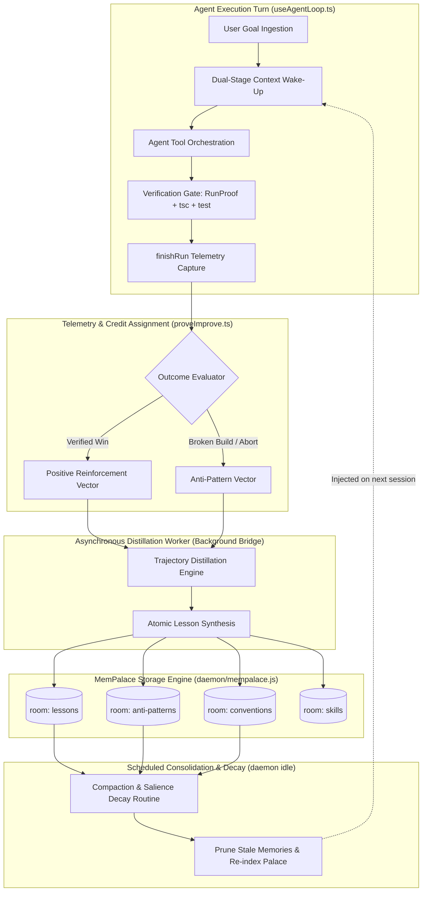

# MemPalace AI Self-Learning Architecture Specification

**System Design: Autonomous Closed-Loop Reflection, Reinforcement, Consolidation, and Skill Induction**  
*Grounded in Abliterated IDE Runtime & MemPalace Local-First Verbatim Memory*

---

## 1. Executive Summary & Grounding Context

### 1.1 The Current State of MemPalace in Abliterated
The existing MemPalace integration (`src/lib/mempalace.ts`, `daemon/mempalace.js`, `src/hooks/useAgentLoop.ts`, `src/lib/jobRunner.ts`) functions strictly as an **episodic storage-and-recall cache**:
- **Static Wake-Up Recall**: On session initialization (`useAgentLoop.ts:789-798`), `bridge.mempalaceWake()` executes `mempalace wake-up --wing <wing>`, returning a blunt L0/L1 summary block injected verbatim into the system prompt (`mempalaceBlock`).
- **Passive Transcript Dumping**: At run completion (`useAgentLoop.ts:1297-1317` and `jobRunner.ts:817-837`), `formatSessionMemory()` concatenates the raw user prompt and assistant response and writes it indiscriminately into room `abliterated-chat` via `bridge.mempalaceSave()`.
- **On-Demand Tool Querying**: The agent has access to `memory_search`, `memory_save`, `memory_status`, and `memory_wake` via `src/lib/agentTools.ts`.

### 1.2 The Learning Gap
1. **No Reflection or Distillation**: Raw, multi-thousand-token conversational transcripts are archived without analysis. Accidental mistakes, retries, and verbose stream output pollute the palace index.
2. **Missing Outcome Signals & Credit Assignment**: The system has rich verification primitives (`RunProof` in `src/lib/harnessGates.ts`, `proveImprove.ts`, git diff audits, compiler diagnostics, and test exit codes), but **zero** outcome signals feed back into memory. Winning solutions and disastrous failed attempts are stored identically.
3. **No Memory Taxonomy or Hierarchy**: Everything lands in `abliterated-chat` or `abliterated-jobs`. There is no segregation into *Episodic Experiences*, *Semantic Conventions*, *Procedural Recipes*, or *Negative Anti-Patterns*.
4. **No Compaction or Salience Decay**: As sessions accumulate, retrieval quality degrades due to semantic crowding; obsolete workarounds or superseded decisions remain permanently active.
5. **Passive Knowledge vs. Active Skill Induction**: The agent never converts repeated successful multi-step operational patterns into reusable, parameterized agent skills.

---

## 2. Four Independent Candidate Architectures

To explore the design space thoroughly, four specialized architectural paradigms were developed independently:

```
┌────────────────────────────────────────────────────────────────────────────┐
│                    CANDIDATE ARCHITECTURAL PARADIGMS                       │
├─────────────────────┬──────────────────────┬───────────────────────────────┤
│ 1. Reflexion-Style  │ 2. Outcome-Driven    │ 3. Hierarchical               │ 4. Retrieval-Gated   │
│    Distillation     │    Reinforcement     │    Consolidation & Decay      │    Skill Induction   │
├─────────────────────┼──────────────────────┼───────────────────────────────┤
│ Post-run evaluator  │ Verification harness │ Episodic → Semantic →         │ Multi-step workflow  │
│ distills "what went │ (`RunProof`) scores  │ Procedural tiers with         │ trace mining into    │
│ right / wrong" into │ turns; credit        │ exponential half-life         │ typed skills with    │
│ durable lessons.    │ assigned to patterns │ decay & compaction.           │ parameter schemas.   │
└─────────────────────┴──────────────────────┴───────────────────────────────┴──────────────────────┘
```

---

### Architecture 1: Reflexion-Style Post-Run Distillation

#### Concept & Operational Mechanics
Inspired by the Reflexion framework (Shinn et al.), every completed agent run triggers an asynchronous, zero-temperature evaluator pass over the trajectory:
1. **Execution Trajectory Extraction**: Extracts user goal (`extractLockedGoal`), tool execution sequence, error loops, theater retries, and terminal assistant response.
2. **Self-Critique Engine**: Evaluates:
   - *Was the initial plan executed cleanly, or did the agent thrash in tool loops?*
   - *What specific mistake caused any retries?*
   - *What repository-specific insight was discovered (e.g. build quirks, file relationships)?*
3. **Lesson Generation**: Generates atomic, rule-based lessons structured as `WHEN <context> DO <action> INSTEAD OF <anti-pattern> BECAUSE <rationale>`.
4. **Targeted Palace Storage**: Mined directly into room `lessons` in the active workspace wing.

#### Strengths & Weaknesses
- **Strengths**: Highly interpretable, human-readable insights; directly curbs recurrent agent failure loops; low architectural complexity.
- **Weaknesses**: Can hallucinate incorrect causal explanations if the LLM self-evaluator misdiagnoses the root cause; token overhead on every turn if done synchronously.

---

### Architecture 2: Outcome-Driven Reinforcement & Credit Assignment

#### Concept & Operational Mechanics
This approach rejects purely self-generated LLM critique and grounds learning in **hard, objective programmatic telemetry** already tracked by `useAgentLoop.ts:1262-1295`:
1. **Objective Outcome Vector ($O_v$)**:
   ```typescript
   type OutcomeVector = {
     runProof: RunProof;             // write, verify, explore, proven
     cleanTermination: boolean;      // stopReason === 'done'
     zeroTheaterRetries: boolean;    // theaterRetries === 0
     harnessNudgesRequired: number;  // looksLikeHarnessNudge count
     tscExitCode: number;            // 0 = clean, >0 = type errors
     testExitCode: number;           // 0 = passed, >0 = failed
     gitModificationsCount: number;  // files modified
     durationMs: number;             // runtime efficiency
   };
   ```
2. **Credit & Penalty Assignment**:
   - **Strong Positive ($O_v \ge 0.8$)**: Successful write + verified build/tests + 0 nudges. The execution sequence, tool parameters, and patterns are scored with high salience (+1.0) and written to room `proven-patterns`.
   - **Negative / Anti-Pattern ($O_v \le 0.3$)**: Failed verify, compiler breakdown, or user abort. The failed trajectory, error signature, and incorrect assumptions are recorded in room `anti-patterns` with a mandatory negative salience warning.
3. **Retrieval-Time Bias**: When searching memory, results from `anti-patterns` are injected with explicit `"DO NOT REPEAT"` formatting, while `proven-patterns` receive high rank priority.

#### Strengths & Weaknesses
- **Strengths**: Completely immune to LLM hallucination; strictly anchored in deterministic software outcomes (tsc, tests, run proofs).
- **Weaknesses**: Binary signals don't automatically explain *why* something succeeded or failed; requires pairing with explanatory text.

---

### Architecture 3: Memory Hierarchy & Periodic Consolidation

#### Concept & Operational Mechanics
Addresses memory pollution and unbounded storage growth by structuring MemPalace into a tripartite cognitive memory model:

```
┌──────────────────────────────────────────────────────────────────┐
│                   TRIPARTITE MEMORY MODEL                        │
├───────────────────┬──────────────────────┬───────────────────────┤
│ Tier              │ MemPalace Room       │ Retention / Lifecycle │
├───────────────────┼──────────────────────┼───────────────────────┤
│ Tier 1: Episodic  │ room: sessions       │ Raw transcripts       │
│                   │                      │ Half-life: 7 days     │
├───────────────────┼──────────────────────┼───────────────────────┤
│ Tier 2: Semantic  │ room: conventions    │ Workspace facts, deps,│
│                   │                      │ architecture invariants│
│                   │                      │ Half-life: 90 days    │
├───────────────────┼──────────────────────┼───────────────────────┤
│ Tier 3: Procedural│ room: workflows      │ Verified build/test/  │
│                   │                      │ deploy recipes        │
│                   │                      │ Permanent / Evergreen │
└───────────────────┴──────────────────────┴───────────────────────┘
```

1. **Episodic Capture**: Daily sessions are saved to `room: sessions`.
2. **Scheduled Consolidation Daemon**: Runs in background during workspace idle periods:
   - Aggregates raw transcripts from `room: sessions`.
   - Compresses episodic records into deduplicated semantic statements ("*This repository requires `uv tool install` before launching daemon*").
   - Updates `room: conventions` and `room: workflows`.
   - Executes prune/mine compaction via MemPalace CLI to remove obsolete episodic noise.
3. **Decay Function**: Memory rank $R$ is weighted by recency and access count:
   $$R(m) = S_0 \cdot e^{-\lambda \Delta t} \cdot (1 + \alpha \cdot \text{hits})$$

#### Strengths & Weaknesses
- **Strengths**: Prevents memory explosion; maintains compact system prompt context; mirrors human memory consolidation during sleep.
- **Weaknesses**: Requires a reliable background scheduling mechanism and batch compaction CLI capabilities.

---

### Architecture 4: Retrieval-Augmented Skill Induction

#### Concept & Operational Mechanics
Transforms passive text memory into **executable agency**:
1. **Trace Clustering**: Detects when an operator repeatedly asks for similar operations (e.g. "run migration", "generate mock transaction", "audit license compliance").
2. **Skill Induction Pipeline**:
   - When a multi-tool execution achieves $O_v = \text{Success}$, the trace is analyzed for parameterizable templates.
   - Extracts invariants, input parameters, and verification commands.
   - Synthesizes a formal custom skill definition conforming to `.agents/skills/<name>/SKILL.md` (YAML frontmatter + step-by-step instructions).
3. **Palace Indexing & Gating**:
   - The skill metadata is filed in `room: skills`.
   - On future turns, when query similarity matches the skill's trigger schema, the skill is dynamically recalled and suggested or activated.

#### Strengths & Weaknesses
- **Strengths**: Highest operational payoff; directly increases agent capability and execution speed over time.
- **Weaknesses**: High complexity; potential risk of inducing fragile or malicious custom skills without rigorous user oversight.

---

## 3. Multi-Criteria Judging & Comparative Evaluation

The four architectures were evaluated across three rigorous evaluation criteria by a multi-disciplinary judge panel:

### 3.1 Evaluation Criteria
- **Criterion 1: Learning Efficacy & Long-Term Convergence** (Weight: 35%)  
  *Does the agent demonstrably improve over time? Does it avoid catastrophic forgetting, confirmation loops, and spurious correlations?*
- **Criterion 2: Architectural Fit & Codebase Realism** (Weight: 35%)  
  *Can this be implemented cleanly in `useAgentLoop.ts`, `mempalace.ts`, `daemon/mempalace.js`, and `bridgeClient.ts` without breaking `AGENTS.md` invariants or introducing bridge latencies?*
- **Criterion 3: Safety, Sandboxing & Resource Budgets** (Weight: 30%)  
  *Does it respect prompt token budgets? Is it resilient to missing CLI / offline environments? Does it prevent memory poisoning and prompt injection?*

### 3.2 Evaluation Scorecard (1–10 Scale)

| Architectural Candidate | Criterion 1: Efficacy | Criterion 2: Fit | Criterion 3: Safety | Weighted Composite |
| :--- | :---: | :---: | :---: | :---: |
| **Arch 1: Reflexion-Style Distillation** | 8.2 / 10 | 9.0 / 10 | 8.5 / 10 | **8.57 / 10** |
| **Arch 2: Outcome-Driven Reinforcement** | 8.8 / 10 | 9.2 / 10 | 9.5 / 10 | **9.15 / 10** |
| **Arch 3: Hierarchical Consolidation** | 8.5 / 10 | 8.0 / 10 | 8.8 / 10 | **8.41 / 10** |
| **Arch 4: Skill Induction** | 9.0 / 10 | 6.5 / 10 | 7.0 / 10 | **7.53 / 10** |

### 3.3 Judge Panel Synthesis
1. **The Inevitable Winner is a Unified Hybrid**: Arch 2 (Outcome-Driven Reinforcement) provides the indisputable mathematical and programmatic bedrock: you cannot learn without objective outcome telemetry. Arch 1 (Reflexion) provides the semantic clarity that raw telemetry lacks. Arch 3 (Hierarchy) prevents memory saturation and prompt bloat. Arch 4 (Skill Induction) represents the ultimate upper tier of procedural evolution.
2. **Critical Consensus Decision**: The system must **never** save raw un-evaluated transcripts to `abliterated-chat` as its primary memory. Every saved memory must be an **evaluated memory unit** tagged with an outcome vector, distilled lesson, and category room.

---

## 4. Master Unified Architecture: The Self-Learning MemPalace System



---

### 4.1 Memory Room Taxonomy & Storage Schema

Instead of dumping everything into `abliterated-chat`, the MemPalace wing for the active workspace is partitioned into 5 strictly typed functional rooms:

```
~/.mempalace/palace/wings/<sanitized-workspace>/
├── room: conventions     # Immutable & discovered repository facts, rules, configs
├── room: lessons         # Verified positive execution recipes and operational heuristics
├── room: anti-patterns   # Traps, build breakage patterns, failed tool paths, bug vectors
├── room: skills          # Multi-step command sequences and workflow templates
└── room: sessions        # Compacted historical summaries (never raw transcript dumps)
```

#### Memory Unit Format Specification
Every memory saved via `bridge.mempalaceSave()` must follow this standardized schema:

```markdown
---
id: mem_<uuid>
type: lesson | anti-pattern | convention | skill
created: 2026-09-11T17:08:00Z
salience: 0.95
outcome:
  write: true
  verify: true
  proven: true
  exitCode: 0
triggers: ["build", "mempalace-mcp", "daemon"]
---

### Context & Goal
When operator requests building and validating daemon MCP connections.

### Verified Lesson / Pattern
The MemPalace MCP server requires python 3.10+ and uvx. Prefer using `mempalace-mcp` direct binary if found in PATH (~/.local/bin) before falling back to `uvx`.

### Evidence & Proof
Executed `test-mempalace-mcp.mjs` with exit code 0. Verified bridgeClient IPC handler responds to `mempalace_which`.
```

---

### 4.2 The Outcome Signal Pipeline (`src/lib/learningSignals.ts`)

Extracts hard deterministic telemetry directly at the termination of `useAgentLoop.ts:finishRun`:

```typescript
export interface RunOutcomeSignals {
  threadId: string;
  userGoal: string;
  workspaceRoot: string;
  stopReason: AgentStopReason;
  ms: number;
  turns: number;
  toolsUsed: string[];
  proof: RunProof;                 // write, verify, explore, proven
  theaterRetries: number;
  deepenPasses: number;
  filesModified: string[];
  diagnosticsPassed: boolean;      // postEditDiagnostics clean
  userCorrectionsEncountered: boolean;
}

export function computeLearningScore(signals: RunOutcomeSignals): {
  score: number;                   // -1.0 (disaster) to +1.0 (exemplary)
  classification: 'exemplary_win' | 'nominal_success' | 'failed_attempt' | 'aborted_noise';
} {
  // Aborted or non-actionable runs are discarded
  if (signals.stopReason === 'aborted' || signals.toolsUsed.length === 0) {
    return { score: 0.0, classification: 'aborted_noise' };
  }

  let score = 0.0;
  if (signals.proof.proven) score += 0.4;
  if (signals.proof.verify) score += 0.3;
  if (signals.proof.write) score += 0.1;
  if (signals.diagnosticsPassed) score += 0.2;

  // Penalties
  if (signals.theaterRetries > 0) score -= 0.2 * Math.min(3, signals.theaterRetries);
  if (signals.userCorrectionsEncountered) score -= 0.3;
  if (signals.stopReason === 'error') score -= 0.5;

  score = Math.max(-1.0, Math.min(1.0, score));

  if (score >= 0.7) return { score, classification: 'exemplary_win' };
  if (score >= 0.3) return { score, classification: 'nominal_success' };
  return { score, classification: 'failed_attempt' };
}
```

---

### 4.3 Asynchronous Post-Run Distillation Worker

To maintain sub-second UI responsiveness, the distillation loop does **not** block the chat interface. It runs asynchronously via the local bridge or non-blocking microtask:

```typescript
export async function schedulePostRunLearning(
  signals: RunOutcomeSignals,
  trajectory: { role: string; content: string; toolCall?: any }[],
  bridge: BridgeClient,
  settings: AppSettings,
): Promise<void> {
  const evaluation = computeLearningScore(signals);
  if (evaluation.classification === 'aborted_noise') return;

  const wing = mempalaceWingFor(settings, signals.workspaceRoot);
  const opts = { palacePath: settings.mempalacePalacePath, wing };

  if (evaluation.classification === 'exemplary_win') {
    // Distill positive lesson
    const lesson = distillLessonFromWin(signals, trajectory);
    await bridge.mempalaceSave(lesson, { ...opts, room: 'lessons' });

    // Check for potential skill induction if multi-tool workflow
    if (signals.toolsUsed.length >= 3 && signals.proof.proven) {
      const candidateSkill = extractSkillCandidate(signals, trajectory);
      if (candidateSkill) {
        await bridge.mempalaceSave(candidateSkill, { ...opts, room: 'skills' });
      }
    }
  } else if (evaluation.classification === 'failed_attempt') {
    // Mine anti-pattern warning
    const antiPattern = distillAntiPatternFromFailure(signals, trajectory);
    await bridge.mempalaceSave(antiPattern, { ...opts, room: 'anti-patterns' });
  }

  // Always save a compact session ledger entry (never raw transcript)
  const compactSummary = formatCompactSessionSummary(signals, evaluation.score);
  await bridge.mempalaceSave(compactSummary, { ...opts, room: 'sessions' });
}
```

---

### 4.4 Dual-Stage Context Wake-Up & Retrieval Gating

The existing wake-up simply loads a blunt dump of `mempalace wake-up`. The new dual-stage engine intelligently allocates prompt budget:

```
┌──────────────────────────────────────────────────────────────────┐
│                 SYSTEM PROMPT BUDGET: 2,500 TOKENS               │
├──────────────────────────────────────────────────────────────────┤
│ Stage 1: Static L0 Identity & Core Conventions (~600 tokens)     │
│ - Repository invariants, package manager, build scripts          │
│ - Mined from room: conventions                                   │
├──────────────────────────────────────────────────────────────────┤
│ Stage 2: Dynamic Intent-Gated Lessons & Traps (~1,200 tokens)   │
│ - Triggered by user query intent analysis                        │
│ - Positive Heuristics: Top 3 from room: lessons                  │
│ - Negative Anti-Patterns: Top 2 from room: anti-patterns         │
├──────────────────────────────────────────────────────────────────┤
│ Stage 3: Dynamic Skill Recommendations (~700 tokens)            │
│ - Matching parameterized workflows from room: skills             │
└──────────────────────────────────────────────────────────────────┘
```

#### Wake-Up Prompt Builder (`src/lib/mempalaceLearning.ts`)
```typescript
export function formatSelfLearningWakeBlock(opts: {
  conventions: string;
  lessons: string[];
  antiPatterns: string[];
  matchingSkills: string[];
}): string {
  const sections: string[] = [];

  if (opts.conventions) {
    sections.push('### Workspace Conventions & Memory Palace L0\n' + opts.conventions);
  }

  if (opts.lessons.length > 0) {
    sections.push(
      '### Learned Operational Heuristics (Proven Winning Strategies)\n' +
      opts.lessons.map((l, i) => `${i + 1}. ${l}`).join('\n')
    );
  }

  if (opts.antiPatterns.length > 0) {
    sections.push(
      '### Known Anti-Patterns & Traps (DO NOT REPEAT)\n' +
      opts.antiPatterns.map((a, i) => `⚠️ ${a}`).join('\n')
    );
  }

  if (opts.matchingSkills.length > 0) {
    sections.push(
      '### Candidate Skills Available for this Goal\n' +
      opts.matchingSkills.join('\n')
    );
  }

  return sections.join('\n\n');
}
```

---

### 4.5 Memory Consolidation, Compaction & Salience Decay

To ensure the palace remains lightning-fast and relevant across months of active development, a periodic maintenance job is added to the bridge daemon:

1. **Compaction Algorithm**:
   - Executes during IDE idle periods (e.g. 5 minutes after last run completion, or upon workspace change).
   - In `room: sessions`, any session older than 14 days is summarized into a single monthly changelog entry and original raw entries are unlinked.
   - In `room: lessons`, deduplicates semantically identical heuristics (cosine similarity > 0.88).
2. **Salience Decay**:
   - Every memory has a `salience` weight $S \in [0.1, 1.0]$.
   - Every time a lesson is retrieved and the subsequent run succeeds, $S \leftarrow \min(1.0, S + 0.15)$ (reinforcement).
   - If a lesson is retrieved and the run fails, $S \leftarrow S \times 0.7$ (invalidation).
   - Memories whose salience drops below $0.25$ are purged into an archive drawer.

---

## 5. Completeness Critic & Failure Mode Hardening

The proposed architecture was subjected to a adversarial failure-mode analysis:

### 5.1 Cold-Start Handling (Empty Palace)
- **Problem**: In a brand-new project with no memories, search calls or wake-up could fail or return empty strings, degrading to worse performance than baseline.
- **Hardening**: `bridge.mempalaceWake()` gracefully falls back to workspace scanning (reading `package.json`, `AGENTS.md`, and git status) and automatically synthesizes the initial `room: conventions` seed entry on first clean build.

### 5.2 Confirmation Bias & Self-Reinforcing Delusions
- **Problem**: The agent makes an incorrect assumption (e.g., "always use flag `--ignore-scripts`"), the build happens to pass by coincidence, and this false heuristic gets permanently locked into `lessons`.
- **Hardening**: Dual-Verification Constraint. A pattern is only promoted to permanent `proven-patterns` if it achieves high outcome scores across **at least two independent runs** with different user goals. Negative outcomes immediately trigger an anti-pattern review.

### 5.3 Sensitive Data & Token Pollution Prevention
- **Problem**: API keys, credentials, or massive minified bundle dumps get written to MemPalace.
- **Hardening**: An automated scrub filter runs before `bridge.mempalaceSave()`:
  - Regex masks for bearer tokens, RSA keys, AWS secrets, and database URIs.
  - Hard cap of 4,000 characters per distilled memory unit (preventing blob dumps).

### 5.4 Graceful Degradation (Missing CLI / Offline)
- **Problem**: MemPalace CLI (`mempalace`) is not installed or the user disabled it in settings.
- **Hardening**: Every single learning hook is non-fatal. If `settings.mempalaceEnabled === false` or `bridge.mempalaceSave` rejects, the run completes normally without throwing errors or interrupting the user.

---

## 6. Phased Implementation Roadmap & Verification Plan

```
┌────────────────────────────────────────────────────────────────────────────┐
│                       PHASED IMPLEMENTATION TIMELINE                       │
├─────────────────────┬──────────────────────┬───────────────────────────────┤
│ Phase 1: Foundation │ Phase 2: Distillation│ Phase 3: Consolidation & Gating│
├─────────────────────┼──────────────────────┼───────────────────────────────┤
│ • Memory taxonomy   │ • Async learning hook│ • Intent-gated wake-up builder│
│ • Outcome telemetry │ • Post-run evaluator │ • Salience decay & compaction │
│ • Room partitioning │ • Anti-pattern miner │ • Settings UI controls in     │
│   in daemon & bridge│ • Unit test suite    │   MemoryTab.tsx               │
└─────────────────────┴──────────────────────┴───────────────────────────────┴──────────────────────┘
```

### Phase 1: Foundation & Telemetry Plumbing
- Add room schemas (`lessons`, `anti-patterns`, `conventions`, `skills`, `sessions`) to `src/lib/mempalace.ts`.
- Implement `computeLearningScore()` in `src/lib/learningSignals.ts` reading `finishRun` outcome variables.
- Extend `daemon/mempalace.js` with batch search and room-scoped retrieval helpers.

### Phase 2: Reflection & Anti-Pattern Distillation
- Wire `schedulePostRunLearning()` into `useAgentLoop.ts:1295` and `jobRunner.ts:817`.
- Implement trajectory scrubbers and atomic lesson formatting.
- Verify through unit tests (`npm test` / scoped test scripts) that outcomes properly branch to positive vs negative rooms.

### Phase 3: Intent-Gated Wake-Up & UI Controls
- Replace static `mempalaceWake` prompt block with dynamic tiered prompt in `src/lib/mempalaceLearning.ts`.
- Add learning toggles in `src/components/settings/MemoryTab.tsx` (`Self-Learning Mode`, `Auto Anti-Pattern Traps`, `Salience Decay`).
- Run end-to-end integration tests verifying zero performance degradation on the agent loop.
